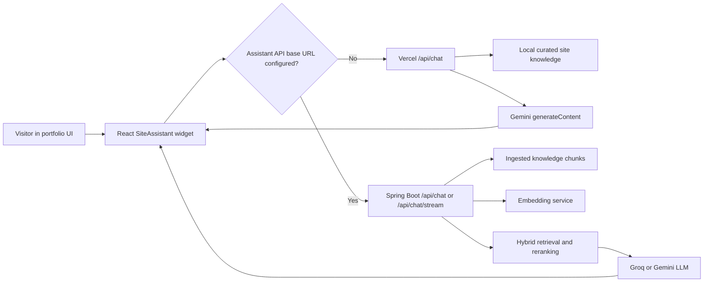

# Sai's Assistant

Sai's Assistant is the AI assistant architecture used behind the portfolio site. This folder is a curated copy of the files related to the assistant implementation, RAG backend, API routes, frontend chat UI reference, and design reference.

The original portfolio is larger than this package. This copy is meant for GitHub documentation, review, and future extraction into a standalone assistant project.

## What This Assistant Does

- Shows a floating chat assistant inside the React portfolio.
- Routes visitor questions either to a Vercel serverless Gemini route or to a Spring Boot RAG backend.
- Retrieves grounded website knowledge before answer generation.
- Returns answer text, source chips, action links, and safe fallback responses.
- Tracks assistant questions through the analytics event pipeline.
- Documents the production architecture through the "Active Builds: Sai's Assistant" page design.

## High-Level Architecture



## Folder Map

```text
sai-assistant-github-package/
  README.md
  .env.example
  .gitignore
  vercel-api/
    vercel.json
    api/
      chat.js
      analytics.js
      lib/rag-knowledge.js
      admin/ingest.js
      admin/webhook.js
  spring-rag-backend/
    pom.xml
    Dockerfile
    README.md
    src/main/java/com/saikumar/assistant/...
    src/main/resources/...
  frontend-reference/
    package.json
    src/App.tsx
    src/lib/analytics.ts
    src/data/portfolio.ts
    src/data/blogs.ts
  design-reference/
    src/index.css
```

## File Responsibilities

### Vercel API Layer

| File | Responsibility |
| --- | --- |
| `vercel-api/api/chat.js` | Lightweight serverless assistant endpoint. It receives the visitor question, merges client context with server-side site knowledge, builds a grounded Gemini prompt, calls Gemini, and returns answer text, citations, action links, session id, and retrieval metadata. |
| `vercel-api/api/lib/rag-knowledge.js` | Local curated knowledge index for the portfolio assistant. It stores profile, project, blog, assistant, and site feature facts, applies tokenization/synonyms/scoring, returns relevant context, builds semantic cache keys, and exposes an ingestion snapshot. |
| `vercel-api/api/admin/ingest.js` | Protected admin route that reports ingestion readiness and the current knowledge snapshot. It is a blueprint endpoint for future vector upsert integration. |
| `vercel-api/api/admin/webhook.js` | Protected webhook route for accepting content refresh events. It returns index version and refresh scope for future ingestion jobs. |
| `vercel-api/api/analytics.js` | Firestore-backed analytics route. It stores and reads events, including `assistant_question`, so the dashboard can show assistant usage. |
| `vercel-api/vercel.json` | Vercel route/header config copied from the portfolio. Useful as deployment reference for SPA rewrites and no-store API headers. |

### Spring RAG Backend

| File or Package | Responsibility |
| --- | --- |
| `spring-rag-backend/pom.xml` | Maven project definition for Spring Boot 3.3, WebFlux, JDBC, validation, actuator, Oracle JDBC, and jsoup. |
| `spring-rag-backend/Dockerfile` | Container build for deploying the RAG backend. |
| `spring-rag-backend/src/main/java/com/saikumar/assistant/controller/ChatController.java` | Exposes `/api/chat` and `/api/chat/stream`. The stream endpoint returns server-sent events. |
| `spring-rag-backend/src/main/java/com/saikumar/assistant/controller/AdminIngestionController.java` | Protected endpoint for ingesting/refreshing source documents into the knowledge repository. |
| `spring-rag-backend/src/main/java/com/saikumar/assistant/config/AssistantProperties.java` | Central configuration model for provider keys, model names, chunking, CORS, rate limits, and retrieval settings. |
| `spring-rag-backend/src/main/java/com/saikumar/assistant/config/ChatRateLimitFilter.java` | Rate limits `/api/chat` requests to protect LLM credits and backend capacity. |
| `spring-rag-backend/src/main/java/com/saikumar/assistant/service/SourceDocumentLoader.java` | Loads structured portfolio and assistant source knowledge. This is the main content source for ingestion. |
| `spring-rag-backend/src/main/java/com/saikumar/assistant/service/DocumentChunker.java` | Splits source documents into overlapping chunks for retrieval. |
| `spring-rag-backend/src/main/java/com/saikumar/assistant/service/IngestionService.java` | Coordinates document loading, chunking, embedding, and repository writes. |
| `spring-rag-backend/src/main/java/com/saikumar/assistant/service/ChatService.java` | Main online RAG flow: sanitize request, handle fast paths, embed question, retrieve chunks, rerank, call LLM, and build response. |
| `spring-rag-backend/src/main/java/com/saikumar/assistant/service/PromptBuilder.java` | Builds grounded prompts with identity rules, retrieved context, and answer constraints. |
| `spring-rag-backend/src/main/java/com/saikumar/assistant/service/GeminiLlmClient.java` | Gemini answer generation client. |
| `spring-rag-backend/src/main/java/com/saikumar/assistant/service/GroqLlmClient.java` | Groq chat-completions answer generation client. |
| `spring-rag-backend/src/main/java/com/saikumar/assistant/service/GeminiEmbeddingService.java` | Gemini embedding provider for retrieval vectors. |
| `spring-rag-backend/src/main/java/com/saikumar/assistant/service/LocalEmbeddingService.java` | Deterministic local embedding fallback for development without external credentials. |
| `spring-rag-backend/src/main/java/com/saikumar/assistant/repository/OracleKnowledgeChunkRepository.java` | Oracle vector-ready persistence and retrieval implementation. |
| `spring-rag-backend/src/main/java/com/saikumar/assistant/repository/InMemoryKnowledgeChunkRepository.java` | Local development repository when Oracle is not configured. |
| `spring-rag-backend/src/main/resources/schema-oracle.sql` | Oracle table/index setup for assistant knowledge chunks. |
| `spring-rag-backend/src/main/resources/application*.yml` | Local and Oracle profile configuration. |

### Frontend Reference

The frontend assistant is currently embedded in the larger portfolio app, so this package keeps the full reference files instead of pretending it is already a separate component.

| File | Responsibility |
| --- | --- |
| `frontend-reference/src/App.tsx` | Contains the `SiteAssistant` component, assistant knowledge/routing helpers, fallback answer generation, stream handling, analytics tracking, and the Active Builds page that documents the assistant architecture. Key sections are listed below. |
| `frontend-reference/src/lib/analytics.ts` | Frontend analytics helper. It tracks `assistant_question` events using `sendBeacon` or `fetch` and keeps a local fallback cache. |
| `frontend-reference/src/data/portfolio.ts` | Portfolio content used by the site and assistant context. |
| `frontend-reference/src/data/blogs.ts` | Blog content used by the site and assistant context. |
| `frontend-reference/package.json` | Original frontend dependency reference for React, Vite, Firebase, and TypeScript. |

Useful `App.tsx` reference points:

| Section | Approximate Lines | What It Contains |
| --- | ---: | --- |
| Assistant types | `852-875` | Message, link, and quick prompt types. |
| Assistant knowledge model | `2590-2645` | Knowledge category, entry, API link, and stream event types. |
| Assistant API config | `2652-2654` | `VITE_ASSISTANT_API_BASE_URL`, non-stream timeout, stream timeout. |
| Local retrieval helpers | `2782-4217` | Stop words, synonyms, context scoring, prompt selection, fallback answers. |
| `SiteAssistant` UI | `4497-5120` | Floating chat widget, request routing, streaming, message rendering, citations, actions, quick prompts. |
| Active Builds card | `6995-7415` | Active builds overview and assistant build routing. |
| Sai's Assistant case study | `7449-7810` | Architecture page sections, pipeline, diagrams, safeguards, roadmap. |
| Assistant injection | `11048-11070` | Wraps portfolio pages with the floating assistant widget. |

### Design Reference

| File | Responsibility |
| --- | --- |
| `design-reference/src/index.css` | Original portfolio stylesheet. It includes both the floating assistant UI styles and the Sai's Assistant architecture page styles. |

Useful CSS reference points:

| Section | Approximate Lines | What It Contains |
| --- | ---: | --- |
| Base assistant widget styles | `7532-7917` | Launcher, panel, header, messages, links, prompts, input form. |
| Responsive assistant fixes | `9331-9411` | Mobile assistant panel and composer behavior. |
| Final assistant behavior fixes | `16778-17747` | Tap-to-open behavior, viewport sizing, dark layer, and visual polish. |
| Active assistant architecture page | `17990-18279` | Case-study layout, architecture nodes, stack cards, principles, roadmap. |
| Assistant blueprint refresh | `18511+` | Additional architecture-first layout refinements. |

## Environment Variables

For the Vercel route:

```env
GEMINI_API_KEY=
GEMINI_MODEL=gemini-2.5-flash
ASSISTANT_ADMIN_SECRET=
ADMIN_INGEST_SECRET=
FIREBASE_SERVICE_ACCOUNT_BASE64=
FIREBASE_PROJECT_ID=
FIREBASE_CLIENT_EMAIL=
FIREBASE_PRIVATE_KEY=
```

For the React frontend:

```env
VITE_ASSISTANT_API_BASE_URL=
```

If `VITE_ASSISTANT_API_BASE_URL` is empty, the frontend uses the local Vercel `/api/chat` route. If it is set, the frontend routes to the Spring backend.

For the Spring backend:

```env
SPRING_PROFILES_ACTIVE=local
ASSISTANT_ADMIN_SECRET=local-dev-secret
ALLOWED_ORIGINS=http://localhost:5173,https://saikumarmediboina.com

LLM_PROVIDER=local
GEMINI_API_KEY=
GEMINI_MODEL=gemini-2.5-flash
GROQ_API_KEY=
GROQ_MODEL=llama-3.1-8b-instant
GROQ_BASE_URL=https://api.groq.com/openai/v1

EMBEDDING_PROVIDER=local
GEMINI_EMBEDDING_MODEL=gemini-embedding-001
EMBEDDING_DIMENSION=1536
MIN_VECTOR_SIMILARITY=0.05

ORACLE_JDBC_URL=
ORACLE_USERNAME=
ORACLE_PASSWORD=
```

## Local Run Notes

### Vercel API Route

The Vercel assistant route is copied as reference. In the original portfolio, it runs through Vercel Functions:

```bash
npm install
npm run dev
```

Then call:

```bash
curl -X POST http://localhost:5173/api/chat \
  -H "Content-Type: application/json" \
  -d "{\"question\":\"Explain Sai's assistant architecture\",\"mode\":\"site\"}"
```

### Spring Backend

From `spring-rag-backend/`:

```bash
mvn spring-boot:run
```

Ingest local knowledge:

```bash
curl -X POST http://localhost:8080/api/admin/ingest \
  -H "Content-Type: application/json" \
  -H "X-Admin-Secret: local-dev-secret" \
  -d "{\"reset\":true}"
```

Ask the assistant:

```bash
curl -X POST http://localhost:8080/api/chat \
  -H "Content-Type: application/json" \
  -d "{\"sessionId\":\"local-1\",\"message\":\"Explain Sai's assistant architecture\"}"
```

Stream an answer:

```bash
curl -N -X POST http://localhost:8080/api/chat/stream \
  -H "Content-Type: application/json" \
  -d "{\"sessionId\":\"local-1\",\"message\":\"What backend projects has Sai worked on?\"}"
```

## GitHub Publishing Checklist

Before pushing this folder to GitHub:

1. Confirm there are no `.env` files or real API keys.
2. Keep wallet files, database credentials, Vercel secrets, Firebase service accounts, and private keys out of the repo.
3. Decide whether to keep `frontend-reference/src/App.tsx` as a full reference file or later extract `SiteAssistant` into a smaller standalone component.
4. Add screenshots or architecture images only if they do not expose private data.
5. Push this folder as its own repository.

## Suggested Future Cleanup

- Extract `SiteAssistant` from `App.tsx` into `components/SiteAssistant.tsx`.
- Move assistant knowledge helpers into `assistant/knowledge.ts`.
- Move API client logic into `assistant/client.ts`.
- Extract assistant styles into `assistant.css`.
- Keep the Spring backend as the long-term production-grade implementation.
